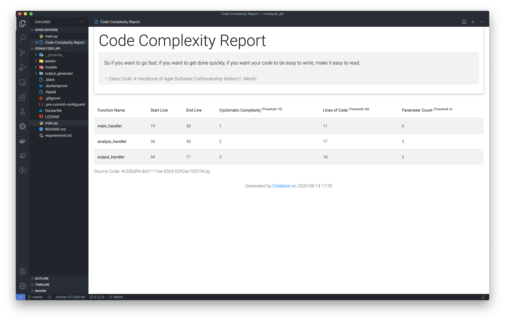

<p align="center">
  
</p>

# Codalyze: Code Complexity REST API

[](http://opensource.org/licenses/MIT)
[](https://github.com/selcukusta/code-analyzer)

[](https://marketplace.visualstudio.com/items?itemName=selcuk-usta.code-complexity-report-generator)
[](https://marketplace.visualstudio.com/items?itemName=selcuk-usta.code-complexity-report-generator)
[](https://marketplace.visualstudio.com/items?itemName=selcuk-usta.code-complexity-report-generator)

[](https://sonarcloud.io/dashboard?id=selcukusta_codalyze-rest-api)
[](https://sonarcloud.io/dashboard?id=selcukusta_codalyze-rest-api)
[](https://sonarcloud.io/dashboard?id=selcukusta_codalyze-rest-api)
[](https://sonarcloud.io/dashboard?id=selcukusta_codalyze-rest-api)
[](https://sonarcloud.io/dashboard?id=selcukusta_codalyze-rest-api)

Create code complexity (Cyclomatic complexity, Lines Of Code, Parameter Count, etc.) report for the activated code file.

Supported languages;

- C++
- C#
- Java
- Javascript
- Objective C
- PHP
- Python
- Ruby
- Swift
- Golang

## Preview of VSCode Extension



## Run locally

```bash
pip install -r requirements.txt
pip install uvicorn
uvicorn main:app --reload
```

## Run via Docker

```bash
docker image build -t [YOUR_REPOSITORY_NAME]/[YOUR_IMAGE_NAME]:latest .
docker container run -d --name analyzer -p 8000:80 [YOUR_REPOSITORY_NAME]/[YOUR_IMAGE_NAME]:latest
```

## Usage

Application has 3 specific endpoints:

### Summary Endpoint

#### Request

`curl --location --request GET 'http://127.0.0.1:8000/'`

#### Response

```json
{
  "Title": "Codalyze: Code Complexity Report",
  "Description": "Create code complexity (Cyclomatic complexity, Lines Of Code, Parameter Count, etc.) report for the activated code file.",
  "Support": "selcukusta(at)gmail(dot)com",
  "API Documentation": "https://codalyze-api.selcukusta.com/docs",
  "Credits": {
    "lizard": "https://github.com/terryyin/lizard",
    "fastapi": "https://github.com/tiangolo/fastapi"
  }
}
```

### Analyze Endpoint

#### Request

```bash
curl --location --request POST 'http://127.0.0.1:8000/analyze/go' \
--header 'Content-Type: application/json' \
--data-raw '{
    "html": "[PASTE_YOUR_CODE]",
    "threshold": {
        "cyclomatic_complexity": 200,
        "lines_of_code": 50,
        "parameter_count": 4
    }
}'
```

#### Response

```json
{
  "total_lines_of_code": 73,
  "functions": [
    {
      "name": "AzureBlobHandler",
      "cyclomatic_complexity": 6,
      "lines_of_code": 52,
      "start_line": 27,
      "end_line": 86,
      "parameter_count": 2
    }
  ]
}
```

### HTML Output Endpoint

#### Request

```bash
curl --location --request POST 'http://127.0.0.1:8000/output/go' \
--header 'Content-Type: application/json' \
--data-raw '{
    "html": "[PASTE_YOUR_CODE]",
    "threshold": {
        "cyclomatic_complexity": 200,
        "lines_of_code": 50,
        "parameter_count": 4
    }
}'
```

#### Response

```html
<!DOCTYPE html>
<html lang="en">
  <head>
    <title>Codalyze: Code Complexity Report</title>
    <meta charset="UTF-8" />
    <meta name="viewport" content="width=device-width, initial-scale=1" />
  </head>
  <body>
    ...
  </body>
</html>
```

## Credits

- [terryyin/lizard](https://github.com/terryyin/lizard) for complexity calculation
- [tiangolo/fastapi](https://github.com/tiangolo/fastapi) for web framework
